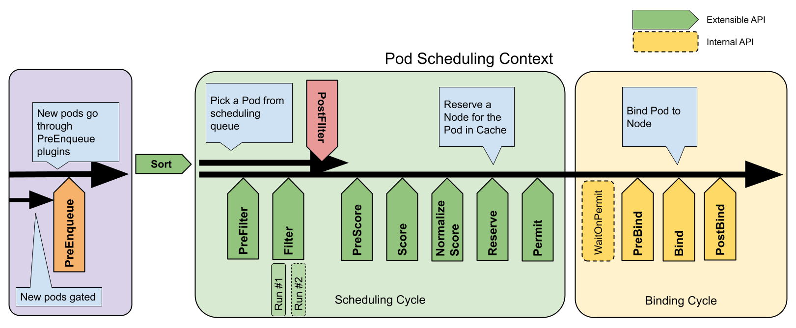
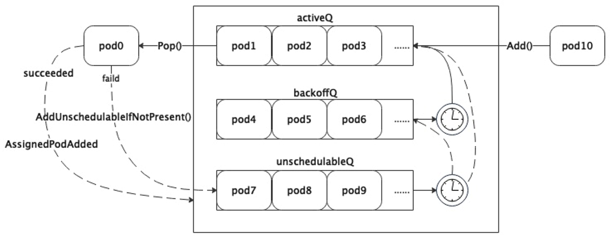

# Scheduler创建流程与调度队列

## 组件的创建

在`Kubernetes`的各个组件中，创建的流程都是类似的，如调度器的创建入口在`cmd/kube-scheduler/scheduler.go`路径下。

```go
func main() {
    // 创建
    command := app.NewSchedulerCommand()
    // 启动
    code := cli.Run(command)
    os.Exit(code)
}
```

创建的实现如下，我们只需要关注`cobra.Command`中`RunE`的实现，这部分代码集中在`cmd/kube-scheduler/app/server.go`中。

```go
func NewSchedulerCommand(registryOptions ...Option) *cobra.Command {
    // explicitly register (if not already registered) the kube effective version and feature gate in DefaultComponentGlobalsRegistry,
    // which will be used in NewOptions.
    _, _ = featuregate.DefaultComponentGlobalsRegistry.ComponentGlobalsOrRegister(
        featuregate.DefaultKubeComponent, utilversion.DefaultBuildEffectiveVersion(), utilfeature.DefaultMutableFeatureGate) 
    // 初始化组件基本配置 返回一个Options结构体的指针
    opts := options.NewOptions()

    cmd := &cobra.Command{
        Use: "kube-scheduler",
        // 持久化的PreRunE钩子函数
        PersistentPreRunE: func(*cobra.Command, []string) error {
            // makes sure feature gates are set before RunE.
            return opts.ComponentGlobalsRegistry.Set()
        },
        // 主要执行函数 关注这个函数即可
        RunE: func(cmd *cobra.Command, args []string) error {
            return runCommand(cmd, opts, registryOptions...)
        },
        // 遍历命令行的args 如果arg长度大于0报错
        // scheduler不支持传入args
        Args: func(cmd *cobra.Command, args []string) error {
            for _, arg := range args {
                if len(arg) > 0 {
                    return fmt.Errorf("%q does not take any arguments, got %q", cmd.CommandPath(), args)
                }
            }
            return nil
        },
    }

    nfs := opts.Flags
    verflag.AddFlags(nfs.FlagSet("global"))
    globalflag.AddGlobalFlags(nfs.FlagSet("global"), cmd.Name(), logs.SkipLoggingConfigurationFlags())
    fs := cmd.Flags()
    for _, f := range nfs.FlagSets {
        fs.AddFlagSet(f)
    }

    cols, _, _ := term.TerminalSize(cmd.OutOrStdout())
    cliflag.SetUsageAndHelpFunc(cmd, *nfs, cols)

    if err := cmd.MarkFlagFilename("config", "yaml", "yml", "json"); err != nil {
        klog.Background().Error(err, "Failed to mark flag filename")
    }

    return cmd
}
```

### Options结构体

看一下`Options`结构体的定义，在路径`cmd/kube-scheduler/app/options/options.go`下。

```go
// Options has all the params needed to run a Scheduler
type Options struct {
    // 调度器核心配置
    ComponentConfig *kubeschedulerconfig.KubeSchedulerConfiguration 
    // 调度器与客户端通信配置
    SecureServing  *apiserveroptions.SecureServingOptionsWithLoopback
    // 认证配置
    Authentication *apiserveroptions.DelegatingAuthenticationOptions
    // 授权配置
    Authorization  *apiserveroptions.DelegatingAuthorizationOptions
    // 性能指标配置
    Metrics        *metrics.Options
    // 日志记录器配置
    Logs           *logs.Options
    // 将要弃用的选项
    Deprecated     *DeprecatedOptions
    // 选举配置
    LeaderElection *componentbaseconfig.LeaderElectionConfiguration
    // 调度器配置文件路径
    ConfigFile string
    // 配置写入路径
    WriteConfigTo string
    // api server地址
    Master string
    // 特性门控配置
    ComponentGlobalsRegistry featuregate.ComponentGlobalsRegistry
    // 存储启动flag参数
    Flags *cliflag.NamedFlagSets
}
```

关键函数`runCommand`，在这个函数中通过`Setup`函数生成了`CompletedConfig`和`Scheduler`类型的实例`cc`和`sched`，然后使用这两个重要对象作为参数启动调度器。

```go
func runCommand(cmd *cobra.Command, opts *options.Options, registryOptions ...Option) error {
    verflag.PrintAndExitIfRequested()
    fg := opts.ComponentGlobalsRegistry.FeatureGateFor(featuregate.DefaultKubeComponent)
    // Activate logging as soon as possible, after that
    // show flags with the final logging configuration.
    if err := logsapi.ValidateAndApply(opts.Logs, fg); err != nil {
        fmt.Fprintf(os.Stderr, "%v\n", err)
        os.Exit(1)
    }
    cliflag.PrintFlags(cmd.Flags())
    // 通常创建一个新的上下文时会从context.Background()开始
    ctx, cancel := context.WithCancel(context.Background())
    defer cancel()
    go func() {
        stopCh := server.SetupSignalHandler()
        <-stopCh
        cancel()
    }()
    // 创建完整配置和调度器实例
    cc, sched, err := Setup(ctx, opts, registryOptions...)
    if err != nil {
        return err
    }
    // add feature enablement metrics
    fg.(featuregate.MutableFeatureGate).AddMetrics() 
    // 启动调度器
    return Run(ctx, cc, sched)
}
```
### Setup函数

`Setup`函数的实现如下，其中`scheduler.New`是调度器实例的创建点。

```go
func Setup(ctx context.Context, opts *options.Options, outOfTreeRegistryOptions ...Option) (*schedulerserverconfig.CompletedConfig, *scheduler.Scheduler, error) {
    // 创建cfg并注入到opt中
    if cfg, err := latest.Default(); err != nil {
        return nil, nil, err
    } else {
        opts.ComponentConfig = cfg
    }
    // 校验
    if errs := opts.Validate(); len(errs) > 0 {
        return nil, nil, utilerrors.NewAggregate(errs)
    }
    // 生成Config 
    // 其中包括两个客户端 一个用于对接api server 一个专门处理事件用于事件广播器中 
    // 创建informer工厂和Leader选举配置
    c, err := opts.Conf
    ig(ctx)
    if err != nil {
        return nil, nil, err
    }

    // 把Config类型转换成CompletedConfig
    cc := c.Complete()

    outOfTreeRegistry := make(runtime.Registry)
    for _, option := range outOfTreeRegistryOptions {
        if err := option(outOfTreeRegistry); err != nil {
            return nil, nil, err
        }
    }

    recorderFactory := getRecorderFactory(&cc)
    completedProfiles := make([]kubeschedulerconfig.KubeSchedulerProfile, 0)
    // 根据CompletedConfig创建调度器实例
    sched, err := scheduler.New(ctx,
        cc.Client,
        cc.InformerFactory,
        cc.DynInformerFactory,
        recorderFactory,
        scheduler.WithComponentConfigVersion(cc.ComponentConfig.TypeMeta.APIVersion),
        scheduler.WithKubeConfig(cc.KubeConfig),
        scheduler.WithProfiles(cc.ComponentConfig.Profiles...),
        scheduler.WithPercentageOfNodesToScore(cc.ComponentConfig.PercentageOfNodesToScore),
        scheduler.WithFrameworkOutOfTreeRegistry(outOfTreeRegistry),
        scheduler.WithPodMaxBackoffSeconds(cc.ComponentConfig.PodMaxBackoffSeconds),
        scheduler.WithPodInitialBackoffSeconds(cc.ComponentConfig.PodInitialBackoffSeconds),
        scheduler.WithPodMaxInUnschedulablePodsDuration(cc.PodMaxInUnschedulablePodsDuration),
        scheduler.WithExtenders(cc.ComponentConfig.Extenders...),
        scheduler.WithParallelism(cc.ComponentConfig.Parallelism),
        scheduler.WithBuildFrameworkCapturer(func(profile kubeschedulerconfig.KubeSchedulerProfile) {
            // Profiles are processed during Framework instantiation to set default plugins and configurations. Capturing them for logging
            completedProfiles = append(completedProfiles, profile)
        }),
    )
    if err != nil {
        return nil, nil, err
    }
    if err := options.LogOrWriteConfig(klog.FromContext(ctx), opts.WriteConfigTo, &cc.ComponentConfig, completedProfiles); err != nil {
        return nil, nil, err
    }
    // 返回配置和实例
    return &cc, sched, nil
```

### New函数

在`New`函数中，完整地创建了一个调度器实例以及相关组件。

```go
func New(ctx context.Context,
    client clientset.Interface,
    informerFactory informers.SharedInformerFactory,
    dynInformerFactory dynamicinformer.DynamicSharedInformerFactory,
    recorderFactory profile.RecorderFactory,
    opts ...Option) (*Scheduler, error) {

    logger := klog.FromContext(ctx)
    stopEverything := ctx.Done()

    options := defaultSchedulerOptions
    for _, opt := range opts {
       opt(&options)
    }

    if options.applyDefaultProfile {
       var versionedCfg configv1.KubeSchedulerConfiguration
       scheme.Scheme.Default(&versionedCfg)
       cfg := schedulerapi.KubeSchedulerConfiguration{}
       if err := scheme.Scheme.Convert(&versionedCfg, &cfg, nil); err != nil {
          return nil, err
       }
       options.profiles = cfg.Profiles
    }
    // registry是注册的in-tree插件列表
    registry := frameworkplugins.NewInTreeRegistry()
    // 合并in-tree和out-of-tree列表
    if err := registry.Merge(options.frameworkOutOfTreeRegistry); err != nil {
       return nil, err
    }

    metrics.Register()

    extenders, err := buildExtenders(logger, options.extenders, options.profiles)
    if err != nil {
       return nil, fmt.Errorf("couldn't build extenders: %w", err)
    }
    // 通过Informer工厂 创建podLister和nodeLister
    podLister := informerFactory.Core().V1().Pods().Lister()
    nodeLister := informerFactory.Core().V1().Nodes().Lister()
    // 初始化全局快照
    snapshot := internalcache.NewEmptySnapshot()
    metricsRecorder := metrics.NewMetricsAsyncRecorder(1000, time.Second, stopEverything)
    // waitingPods holds all the pods that are in the scheduler and waiting in the permit stage
    waitingPods := frameworkruntime.NewWaitingPodsMap()

    var resourceClaimCache *assumecache.AssumeCache
    var draManager framework.SharedDRAManager
    // 如果动态资源分配的特性门控开启 创建资源申请的Informmer Cache和DRA Manager
    if utilfeature.DefaultFeatureGate.Enabled(features.DynamicResourceAllocation) {
       resourceClaimInformer := informerFactory.Resource().V1beta1().ResourceClaims().Informer()
       resourceClaimCache = assumecache.NewAssumeCache(logger, resourceClaimInformer, "ResourceClaim", "", nil)
       draManager = dynamicresources.NewDRAManager(ctx, resourceClaimCache, informerFactory)
    }
    // 根据上面的参数 创建一个完整的Profile
    profiles, err := profile.NewMap(ctx, options.profiles, registry, recorderFactory,
       frameworkruntime.WithComponentConfigVersion(options.componentConfigVersion),
       frameworkruntime.WithClientSet(client),
       frameworkruntime.WithKubeConfig(options.kubeConfig),
       frameworkruntime.WithInformerFactory(informerFactory),
       frameworkruntime.WithSharedDRAManager(draManager),
       frameworkruntime.WithSnapshotSharedLister(snapshot),
       frameworkruntime.WithCaptureProfile(frameworkruntime.CaptureProfile(options.frameworkCapturer)),
       frameworkruntime.WithParallelism(int(options.parallelism)),
       frameworkruntime.WithExtenders(extenders),
       frameworkruntime.WithMetricsRecorder(metricsRecorder),
       frameworkruntime.WithWaitingPods(waitingPods),
    )
    if err != nil {
       return nil, fmt.Errorf("initializing profiles: %v", err)
    }

    if len(profiles) == 0 {
       return nil, errors.New("at least one profile is required")
    }
    // 调度队列的相关配置
    preEnqueuePluginMap := make(map[string][]framework.PreEnqueuePlugin)
    queueingHintsPerProfile := make(internalqueue.QueueingHintMapPerProfile)
    var returnErr error
    for profileName, profile := range profiles {
       preEnqueuePluginMap[profileName] = profile.PreEnqueuePlugins()
       queueingHintsPerProfile[profileName], err = buildQueueingHintMap(ctx, profile.EnqueueExtensions())
       if err != nil {
          returnErr = errors.Join(returnErr, err)
       }
    }

    if returnErr != nil {
       return nil, returnErr
    }
    // 创建调度队列实例 PriorityQueue实例主要包括了activeQ/podBackoffQ/unschedulablePods、nsLister和nominator
    podQueue := internalqueue.NewSchedulingQueue(
       profiles[options.profiles[0].SchedulerName].QueueSortFunc(),
       informerFactory,
       internalqueue.WithPodInitialBackoffDuration(time.Duration(options.podInitialBackoffSeconds)*time.Second),
       internalqueue.WithPodMaxBackoffDuration(time.Duration(options.podMaxBackoffSeconds)*time.Second),
       internalqueue.WithPodLister(podLister),
       internalqueue.WithPodMaxInUnschedulablePodsDuration(options.podMaxInUnschedulablePodsDuration),
       internalqueue.WithPreEnqueuePluginMap(preEnqueuePluginMap),
       internalqueue.WithQueueingHintMapPerProfile(queueingHintsPerProfile),
       internalqueue.WithPluginMetricsSamplePercent(pluginMetricsSamplePercent),
       internalqueue.WithMetricsRecorder(*metricsRecorder),
    )
    // 用创建出来的PQ给framework实例设置PodNominator和PodActivator
    for _, fwk := range profiles {
       fwk.SetPodNominator(podQueue)
       fwk.SetPodActivator(podQueue)
    }
    // 创建调度器缓存
    schedulerCache := internalcache.New(ctx, durationToExpireAssumedPod)

    // cache debugger的作用包括比较Lister和Cache.Snapshot的数据一致性和记录缓存/调度队列信息
    debugger := cachedebugger.New(nodeLister, podLister, schedulerCache, podQueue)
    debugger.ListenForSignal(ctx)
    // 实例创建
    sched := &Scheduler{
       Cache:                    schedulerCache,
       client:                   client,
       nodeInfoSnapshot:         snapshot,
       percentageOfNodesToScore: options.percentageOfNodesToScore,
       Extenders:                extenders,
       StopEverything:           stopEverything,
       SchedulingQueue:          podQueue,
       Profiles:                 profiles,
       logger:                   logger,
    }
    sched.NextPod = podQueue.Pop
    sched.applyDefaultHandlers()
    // 注册事件处理器
    if err = addAllEventHandlers(sched, informerFactory, dynInformerFactory, resourceClaimCache, unionedGVKs(queueingHintsPerProfile)); err != nil {
       return nil, fmt.Errorf("adding event handlers: %w", err)
    }

    return sched, nil
}
```

## 调度器实例的启动

`Run`函数位于`cmd/kube-scheduler/app/server.go`，和`runCommand`函数在同一路径下，完整过程包括：

1. 先启动日志记录器，输出`Info`级别的环境信息日志
2. 根据`componentconfig`注册配置`configz`，类型是`Config`指针
3. 启动事件广播器
4. 初始化健康检查设置，包括`WatchDog`和`Shutdown`检查器
5. 检查是否为`Leader`
6. 创建同步处理健康检查器
7. 协调`Leader`选举
8. 启动健康检查器Server
9. 启动所有`Informer`并等待同步
10. 运行调度器实例

```go
func Run(ctx context.Context, cc *schedulerserverconfig.CompletedConfig, sched *scheduler.Scheduler) error {
    logger := klog.FromContext(ctx)

    // To help debugging, immediately log version
    logger.Info("Starting Kubernetes Scheduler", "version", utilversion.Get())

    logger.Info("Golang settings", "GOGC", os.Getenv("GOGC"), "GOMAXPROCS", os.Getenv("GOMAXPROCS"), "GOTRACEBACK", os.Getenv("GOTRACEBACK"))

    // Configz registration.
    if cz, err := configz.New("componentconfig"); err != nil {
       return fmt.Errorf("unable to register configz: %s", err)
    } else {
       cz.Set(cc.ComponentConfig)
    }

    // Start events processing pipeline.
    cc.EventBroadcaster.StartRecordingToSink(ctx.Done())
    defer cc.EventBroadcaster.Shutdown()

    // Setup healthz checks.
    var checks, readyzChecks []healthz.HealthChecker
    if cc.ComponentConfig.LeaderElection.LeaderElect {
       checks = append(checks, cc.LeaderElection.WatchDog)
       readyzChecks = append(readyzChecks, cc.LeaderElection.WatchDog)
    }
    readyzChecks = append(readyzChecks, healthz.NewShutdownHealthz(ctx.Done()))

    waitingForLeader := make(chan struct{})
    isLeader := func() bool {
       select {
       case _, ok := <-waitingForLeader:
          // if channel is closed, we are leading
          return !ok
       default:
          // channel is open, we are waiting for a leader
          return false
       }
    }

    handlerSyncReadyCh := make(chan struct{})
    handlerSyncCheck := healthz.NamedCheck("sched-handler-sync", func(_ *http.Request) error {
       select {
       case <-handlerSyncReadyCh:
          return nil
       default:
       }
       return fmt.Errorf("waiting for handlers to sync")
    })
    readyzChecks = append(readyzChecks, handlerSyncCheck)

    if cc.LeaderElection != nil && utilfeature.DefaultFeatureGate.Enabled(kubefeatures.CoordinatedLeaderElection) {
       binaryVersion, err := semver.ParseTolerant(featuregate.DefaultComponentGlobalsRegistry.EffectiveVersionFor(featuregate.DefaultKubeComponent).BinaryVersion().String())
       if err != nil {
          return err
       }
       emulationVersion, err := semver.ParseTolerant(featuregate.DefaultComponentGlobalsRegistry.EffectiveVersionFor(featuregate.DefaultKubeComponent).EmulationVersion().String())
       if err != nil {
          return err
       }

       // Start lease candidate controller for coordinated leader election
       leaseCandidate, waitForSync, err := leaderelection.NewCandidate(
          cc.Client,
          metav1.NamespaceSystem,
          cc.LeaderElection.Lock.Identity(),
          "kube-scheduler",
          binaryVersion.FinalizeVersion(),
          emulationVersion.FinalizeVersion(),
          coordinationv1.OldestEmulationVersion,
       )
       if err != nil {
          return err
       }
       readyzChecks = append(readyzChecks, healthz.NewInformerSyncHealthz(waitForSync))
       go leaseCandidate.Run(ctx)
    }

    // Start up the healthz server.
    if cc.SecureServing != nil {
       handler := buildHandlerChain(newHealthEndpointsAndMetricsHandler(&cc.ComponentConfig, cc.InformerFactory, isLeader, checks, readyzChecks), cc.Authentication.Authenticator, cc.Authorization.Authorizer)
       // TODO: handle stoppedCh and listenerStoppedCh returned by c.SecureServing.Serve
       if _, _, err := cc.SecureServing.Serve(handler, 0, ctx.Done()); err != nil {
          // fail early for secure handlers, removing the old error loop from above
          return fmt.Errorf("failed to start secure server: %v", err)
       }
    }

    startInformersAndWaitForSync := func(ctx context.Context) {
       // Start all informers.
       cc.InformerFactory.Start(ctx.Done())
       // DynInformerFactory can be nil in tests.
       if cc.DynInformerFactory != nil {
          cc.DynInformerFactory.Start(ctx.Done())
       }

       // Wait for all caches to sync before scheduling.
       cc.InformerFactory.WaitForCacheSync(ctx.Done())
       // DynInformerFactory can be nil in tests.
       if cc.DynInformerFactory != nil {
          cc.DynInformerFactory.WaitForCacheSync(ctx.Done())
       }

       // Wait for all handlers to sync (all items in the initial list delivered) before scheduling.
       if err := sched.WaitForHandlersSync(ctx); err != nil {
          logger.Error(err, "waiting for handlers to sync")
       }

       close(handlerSyncReadyCh)
       logger.V(3).Info("Handlers synced")
    }
    if !cc.ComponentConfig.DelayCacheUntilActive || cc.LeaderElection == nil {
       startInformersAndWaitForSync(ctx)
    }
    // If leader election is enabled, runCommand via LeaderElector until done and exit.
    if cc.LeaderElection != nil {
       if utilfeature.DefaultFeatureGate.Enabled(kubefeatures.CoordinatedLeaderElection) {
          cc.LeaderElection.Coordinated = true
       }
       cc.LeaderElection.Callbacks = leaderelection.LeaderCallbacks{
          OnStartedLeading: func(ctx context.Context) {
             close(waitingForLeader)
             if cc.ComponentConfig.DelayCacheUntilActive {
                logger.Info("Starting informers and waiting for sync...")
                startInformersAndWaitForSync(ctx)
                logger.Info("Sync completed")
             }
             sched.Run(ctx)
          },
          OnStoppedLeading: func() {
             select {
             case <-ctx.Done():
                // We were asked to terminate. Exit 0.
                logger.Info("Requested to terminate, exiting")
                os.Exit(0)
             default:
                // We lost the lock.
                logger.Error(nil, "Leaderelection lost")
                klog.FlushAndExit(klog.ExitFlushTimeout, 1)
             }
          },
       }
       leaderElector, err := leaderelection.NewLeaderElector(*cc.LeaderElection)
       if err != nil {
          return fmt.Errorf("couldn't create leader elector: %v", err)
       }

       leaderElector.Run(ctx)

       return fmt.Errorf("lost lease")
    }

    // Leader election is disabled, so runCommand inline until done.
    close(waitingForLeader)
    sched.Run(ctx)
    return fmt.Errorf("finished without leader elect")
}
```

## 调度器运行原理

上面已经说到了创建完成后直接运行调度器实例，来看一下调度器的启动到底都包含哪些步骤，代码路径`pkg/scheduler/scheduler.go`

`Run`函数的实现非常简单，第一步先启动日志记录器，然后启动调度队列和调度循环，然后等待`ctx.Done()`信号使线程阻塞，如果收到了`ctx.Done()`信号就对调度队列和调度插件执行`Close()`操作释放资源，其中`ScheduleOne`是在一个协程中启动的，原因是为了避免在没有Pod需要调度时挂起状态的`ScheduleOne`阻塞了后续的信号接收，导致调度队列无法关闭造成的死锁情况。

其中涉及到一个核心结构`SchedulingQueue`和核心方法`ScheduleOne`，先抛出一个官方文档中的流程图，在后面会进行详细说明。



```go
// Run begins watching and scheduling. It starts scheduling and blocked until the context is done.
func (sched *Scheduler) Run(ctx context.Context) {
    logger := klog.FromContext(ctx) 
    // 启动调度队列
    sched.SchedulingQueue.Run(logger)
    
    // 启动调度循环
    go wait.UntilWithContext(ctx, sched.ScheduleOne, 0)
    // 阻塞 等待关闭信号
    <-ctx.Done() 
    // 关闭调度队列
    sched.SchedulingQueue.Close()
    
    // 关闭调度插件
    err := sched.Profiles.Close()
    if err != nil {
        logger.Error(err, "Failed to close plugins")
    }
}
```

## 调度队列详解

上一节说到启动调度器包括：`启动调度队列`和`启动调度循环`，在此详细解释调度队列的实现，如果不关注调度队列的实现可以先跳过本节。

### Pod在队列中的类型

调度队列中的Pod结构是`QueuedPodInfo`，它是由`PodInfo`加上了`Pod`在队列中的一些属性，包括入队时间戳、尝试次数、首次入队时间和导致调度失败的插件集合所共同组成，类型定义如下，在路径`pkg/scheduler/framework/types.go`下。

```go
type QueuedPodInfo struct {
    // Pod信息
    *PodInfo
    // 本次入队时间
    Timestamp time.Time
    // 失败次数
    Attempts int
    // 首次入队时间
    InitialAttemptTimestamp *time.Time
    // 导致Pod以Unschedulable或UnschedulableAndUnresolvable状态返回的插件列表
    // 会导致这两种状态的插件类型包括PreFilter, Filter, Reserve, Permit, PreBind.
    UnschedulablePlugins sets.Set[string]
    // 导致Pod以Pending状态返回的插件列表
    PendingPlugins sets.Set[string]
    // Whether the Pod is scheduling gated (by PreEnqueuePlugins) or not.
    Gated bool
}
```

`PodInfo`结构体是调度过程中最常见的数据类型，其中包含`Pod`类型和软/硬亲和/反亲和信息。

```go
type PodInfo struct {
    Pod                        *v1.Pod
    RequiredAffinityTerms      []AffinityTerm
    RequiredAntiAffinityTerms  []AffinityTerm
    PreferredAffinityTerms     []WeightedAffinityTerm
    PreferredAntiAffinityTerms []WeightedAffinityTerm
}
```

### 调度队列

调度队列`SchedulingQueue`是一个接口类型

```go
type SchedulingQueue interface {
    // 调度过程中可能需要同步Pod状态给提名器 和队列没有直接关系
    framework.PodNominator 
    // 向队列中添加待调度的Pod
    Add(logger klog.Logger, pod *v1.Pod)
    // 添加Pod到ActiveQ
    Activate(logger klog.Logger, pods map[string]*v1.Pod)
    // 把无法调度的Pod加回调度队列 和schedulingHint策略相关
    AddUnschedulableIfNotPresent(logger klog.Logger, pod *framework.QueuedPodInfo, podSchedulingCycle int64) error
    // 调度周期 每Pop一次算一个周期
    SchedulingCycle() int64
    // 从队头弹出Pod
    Pop(logger klog.Logger) (*framework.QueuedPodInfo, error)
    // 标记一个Pod处理完成
    Done(types.UID) 
    // 更新Pod
    Update(logger klog.Logger, oldPod, newPod *v1.Pod) 
    // 删除Pod
    Delete(pod *v1.Pod)
    // 把所有不可调度Pod移动到ActiveQ或BackoffQ
    MoveAllToActiveOrBackoffQueue(logger klog.Logger, event framework.ClusterEvent, oldObj, newObj interface{}, preCheck PreEnqueueCheck) 
    // 关联Pod被添加
    AssignedPodAdded(logger klog.Logger, pod *v1.Pod) 
    // 关联Pod被更新
    AssignedPodUpdated(logger klog.Logger, oldPod, newPod *v1.Pod, event framework.ClusterEvent)
    // 关闭调度队列
    Close()
    // 启动调度队列
    Run(logger klog.Logger)
}
```

### 优先队列

在`Kubernetes`中实现了`SchedulingQueue`的类型是`PriorityQueue`优先队列，从它直接实现了`SchedulingQueue`接口，又通过`SchedulingQueue`间接实现了`PodActivator`，`PodNominator`两种接口，以上可以看出优先队列具有的能力包括：调度队列的基本能力、把一个Pod加入`ActiveQ`的能力和处理`NominatedPod`的能力。

```go
type PriorityQueue struct {
    // 提名器
    *nominator
    // 接收停止信号的通道
    stop  chan struct{}
    // 时钟
    clock clock.Clock
    // 锁
    lock sync.RWMutex
    // Pod初始退避时长
    podInitialBackoffDuration time.Duration
    // Pod最大退避时长
    podMaxBackoffDuration time.Duration
    // Pod在unschedulablePods中的最大时长
    podMaxInUnschedulablePodsDuration time.Duration
    // ActiveQ
    activeQ activeQueuer
    // BackoffQ
    podBackoffQ *heap.Heap[*framework.QueuedPodInfo]
    // unschedulablePods
    unschedulablePods *UnschedulablePods
    // preEnqueue插件列表
    preEnqueuePluginMap map[string][]framework.PreEnqueuePlugin
    // key是profil value是QueueingHintFunction列表
    queueingHintMap QueueingHintMapPerProfile
    // 命名空间Lister
    nsLister listersv1.NamespaceLister
    // 指标记录器
    metricsRecorder metrics.MetricAsyncRecorder
    // 插件指标采样百分比
    pluginMetricsSamplePercent int
    // SchedulingQueueHint特性门控开关
    isSchedulingQueueHintEnabled bool
}
```

#### 优先队列的实现

了解过调度队列的话，一定会听说过存在着三种队列：`ActiveQ`，`BackoffQ`，`unschedulablePods`。

首先通过`PriorityQueue`的结构，可以看到`ActiveQ`和`BackoffQ`底层都是`heap.Heap`，来看一下`Heap`到底是什么。

泛型结构体`Heap`的定义位于`pkg/scheduler/backend/heap/heap.go`中，其中只包括自定义堆中元素`data`和指标记录器。

```go
type Heap[T any] struct {
    // data stores objects and has a queue that keeps their ordering according
    // to the heap invariant.
    data *data[T]
    // metricRecorder updates the counter when elements of a heap get added or
    // removed, and it does nothing if it's nil
    metricRecorder metrics.MetricRecorder
}
```

再看堆元素`data`是如何实现的，堆的设计天然维护了其中元素的顺序，所以`ActiveQ`和`BackoffQ`实际上是两个优先队列。

```go
type data[T any] struct {
    // 存储堆中元素的表 用于快速索引
    items map[string]*heapItem[T]
    // 优先队列 维护了元素的顺序
    queue []string
    // 生成item key的规则
    keyFunc KeyFunc[T]
    // 堆元素排序的规则
    lessFunc LessFunc[T]
}
```

再来看`UnschedulablePods`类型，可以看到这个队列实际只是一个`Map`结构，其中的元素不具有顺序，严格来说不是一个队列。

```go
type UnschedulablePods struct {
    // 记录Pod信息的表 key是Pod的full-name value是指针
    podInfoMap map[string]*framework.QueuedPodInfo
    // key生成函数
    keyFunc    func(*v1.Pod) string
    // 指标记录器
    unschedulableRecorder, gatedRecorder metrics.MetricRecorder
}

// keyFunc函数的实现 实际上就是Pod名称和namespace的拼接
func GetPodFullName(pod *v1.Pod) string {
    return pod.Name + "_" + pod.Namespace
}
```

### 调度队列的几种方法

#### Run

`Run`方法的作用是启动两个`goroutine`，一个`goroutine`每秒执行一次把`BackoffQ`中超过退避时间的Pod移动到`ActiveQ`中，另一个`goroutine`每30秒执行一次把`unschedulablePods`中已到期的Pod根据一定的策略刷新其在调度队列中的位置。

```go
// Run starts the goroutine to pump from podBackoffQ to activeQ
func (p *PriorityQueue) Run(logger klog.Logger) {
    // 启动周期任务goroutine 把BackoffQ中完成退避的Pod移动到ActiveQ
    go wait.Until(func() {
       p.flushBackoffQCompleted(logger)
    }, 1.0*time.Second, p.stop)
    // 启动周期任务goroutine 把unschedulablePods中已到期的Pod移动到ActiveQ/BackoffQ
    go wait.Until(func() {
       p.flushUnschedulablePodsLeftover(logger)
    }, 30*time.Second, p.stop)
}

// flushBackoffQCompleted Moves all pods from backoffQ which have completed backoff in to activeQ
func (p *PriorityQueue) flushBackoffQCompleted(logger klog.Logger) {
    p.lock.Lock()
    defer p.lock.Unlock() 
    // 标志位 表示是否有Pod被移动
    activated := false
    for {
        // 看队首是否有元素 如果空队列直接退出
        pInfo, ok := p.podBackoffQ.Peek()
        if !ok || pInfo == nil {
            break
        }
        pod := pInfo.Pod 
        // 比较backoffTime即(Timestamp+duration)和当前时间 
        //没完成退避就退出 因为堆顶元素是退避完成时间最早的
        if p.isPodBackingoff(pInfo) {
            break
        }
        _, err := p.podBackoffQ.Pop()
        if err != nil {
            logger.Error(err, "Unable to pop pod from backoff queue despite backoff completion", "pod", klog.KObj(pod))
            break
        }
        // 移动该Pod到ActiveQ
        if added := p.moveToActiveQ(logger, pInfo, framework.BackoffComplete); added {
            // 更新标志位
            activated = true
        }
    }

    if activated {
        // 广播唤醒所有等待对ActiveQ执行Pop的goroutine
        p.activeQ.broadcast()
    }
}

func (p *PriorityQueue) moveToActiveQ(logger klog.Logger, pInfo *framework.QueuedPodInfo, event string) bool {
    gatedBefore := pInfo.Gated 
    // 运行PreEnqueue插件
    pInfo.Gated = !p.runPreEnqueuePlugins(context.Background(), pInfo)
    // 添加到ActiveQ的标志位
    added := false
    p.activeQ.underLock(func(unlockedActiveQ unlockedActiveQueuer) {
        // 如果PreEnqueue插件运行没通过 加到unschedulablePods中
        if pInfo.Gated {
            // Add the Pod to unschedulablePods if it's not passing PreEnqueuePlugins.
            if unlockedActiveQ.Has(pInfo) {
                return
            }
            if p.podBackoffQ.Has(pInfo) {
                return
            }
            p.unschedulablePods.addOrUpdate(pInfo)
            return
        }
        if pInfo.InitialAttemptTimestamp == nil {
            now := p.clock.Now()
            pInfo.InitialAttemptTimestamp = &now
        }
        // 运行通过了就加到ActiveQ
        unlockedActiveQ.AddOrUpdate(pInfo) 
        // 更新标志位
        added = true
        // 从BackoffQ和unschedulablePods删除 保证Pod信息在队列中的唯一性
        p.unschedulablePods.delete(pInfo.Pod, gatedBefore)
        _ = p.podBackoffQ.Delete(pInfo)
        logger.V(5).Info("Pod moved to an internal scheduling queue", "pod", klog.KObj(pInfo.Pod), "event", event, "queue", activeQ)
        metrics.SchedulerQueueIncomingPods.WithLabelValues("active", event).Inc()
        if event == framework.EventUnscheduledPodAdd.Label() || event == framework.EventUnscheduledPodUpdate.Label() {
            // 置空Pod的提名节点
            p.AddNominatedPod(logger, pInfo.PodInfo, nil)
        }
    })
    return added
}

// flushUnschedulablePodsLeftover moves pods which stay in unschedulablePods
// longer than podMaxInUnschedulablePodsDuration to backoffQ or activeQ.
func (p *PriorityQueue) flushUnschedulablePodsLeftover(logger klog.Logger) {
    p.lock.Lock()
    defer p.lock.Unlock()

    var podsToMove []*framework.QueuedPodInfo
    currentTime := p.clock.Now() 
    // 遍历unschedulablePods 找出所有超出最大停留时长的Pod
    for _, pInfo := range p.unschedulablePods.podInfoMap {
        lastScheduleTime := pInfo.Timestamp
        if currentTime.Sub(lastScheduleTime) > p.podMaxInUnschedulablePodsDuration {
            podsToMove = append(podsToMove, pInfo)
        }
    }

    if len(podsToMove) > 0 {
        // 把这些Pod更新到ActiveQ或BackoffQ
        p.movePodsToActiveOrBackoffQueue(logger, podsToMove, framework.EventUnschedulableTimeout, nil, nil)
    }
}

func (p *PriorityQueue) movePodsToActiveOrBackoffQueue(logger klog.Logger, podInfoList []*framework.QueuedPodInfo, event framework.ClusterEvent, oldObj, newObj interface{}) {
    if !p.isEventOfInterest(logger, event) {
        // No plugin is interested in this event.
        return
    }

    activated := false
    for _, pInfo := range podInfoList {
        if pInfo.Gated && pInfo.UnschedulablePlugins.Has(names.SchedulingGates) {
            continue
        }
        // 判断schedulingHint来决定入队方式
        schedulingHint := p.isPodWorthRequeuing(logger, pInfo, event, oldObj, newObj)
        if schedulingHint == queueSkip {
            logger.V(5).Info("Event is not making pod schedulable", "pod", klog.KObj(pInfo.Pod), "event", event.Label())
            continue
        }
        // 先从unschedulablePods删除
        p.unschedulablePods.delete(pInfo.Pod, pInfo.Gated) 
        // 再根据schedulingHint执行入队操作 并返回新的队列
        queue := p.requeuePodViaQueueingHint(logger, pInfo, schedulingHint, event.Label())
        logger.V(4).Info("Pod moved to an internal scheduling queue", "pod", klog.KObj(pInfo.Pod), "event", event.Label(), "queue", queue, "hint", schedulingHint) 
        // 如果进入activeQ 后续广播唤醒阻塞goroutine
        if queue == activeQ {
            activated = true
        }
    }

    p.moveRequestCycle = p.activeQ.schedulingCycle()

    if p.isSchedulingQueueHintEnabled {
        if added := p.activeQ.addEventIfAnyInFlight(oldObj, newObj, event); added {
            logger.V(5).Info("Event received while pods are in flight", "event", event.Label())
        }
    }

    if activated {
        p.activeQ.broadcast()
    }
}
```

#### Add

有新的Pod创建时是一个`v1.Pod`类型的指针，`Add`方法把它转换为`PodInfo`在调度队列中的形态`QueuedPodInfo`，并通过`QueuedPodInfo`方法把该Pod信息加入到`ActiveQ`。

```go
func (p *PriorityQueue) Add(logger klog.Logger, pod *v1.Pod) {
    p.lock.Lock()
    defer p.lock.Unlock()
    // Pod信息类型转换
    pInfo := p.newQueuedPodInfo(pod)
    // 加入到ActiveQ
    if added := p.moveToActiveQ(logger, pInfo, framework.EventUnscheduledPodAdd.Label()); added {
        // 成功加入后唤醒其他协程 
        p.activeQ.broadcast()
    }
}
```

#### Update

如果Pod属性发生变化，考虑几种场景：是否开启`SchedulingQueueHint`，`oldPod`是否存在于在调度队列中(`ActiveQ`/`BackoffQ`/`unschedulablePods`)。从`unschedulablePods`中尝试移动时，`SchedulingQueueHint`特性门控的`开`/`关`分别是两个逻辑路径，如果特性门控开启则根据`SchedulingQueueHint`的值决定入队方式，否则一般依次尝试。

```go
func (p *PriorityQueue) Update(logger klog.Logger, oldPod, newPod *v1.Pod) {
    p.lock.Lock()
    defer p.lock.Unlock()

    var events []framework.ClusterEvent
    // 如果开启了SchedulingQueueHint
    if p.isSchedulingQueueHintEnabled {
       events = framework.PodSchedulingPropertiesChange(newPod, oldPod)
        // 如果Pod处于InFlight(处理中)状态 就直接返回
       if exists := p.activeQ.addEventsIfPodInFlight(oldPod, newPod, events); exists {
          logger.V(6).Info("The pod doesn't be queued for now because it's being scheduled and will be queued back if necessary", "pod", klog.KObj(newPod))
          return
       }
    }    
    // 如果oldPod不为空时
    if oldPod != nil {
       // 把v1.Pod先转换成QueuedPodInfo
       oldPodInfo := newQueuedPodInfoForLookup(oldPod)
       // 如果在ActiveQ中存在
       // activeQ.update内部实现与在其他队列中更新完全相同
       // 都是执行pInfo.Update + AddOrUpdate
       if pInfo := p.activeQ.update(newPod, oldPodInfo); pInfo != nil {
          // 在调度队列中处理后 也尝试在提名器中更新
          p.UpdateNominatedPod(logger, oldPod, pInfo.PodInfo)
          return
       }

       // 如果在BackoffQ中存在
       if pInfo, exists := p.podBackoffQ.Get(oldPodInfo); exists {
          // 更新PodInfo 
          _ = pInfo.Update(newPod)
          // 尝试在提名器中更新
          p.UpdateNominatedPod(logger, oldPod, pInfo.PodInfo)
          // 和activeQ.update实际逻辑相同
          p.podBackoffQ.AddOrUpdate(pInfo)
          return
       }
    }

    // 如果在unschedulablePods中存在
    if pInfo := p.unschedulablePods.get(newPod); pInfo != nil {
       _ = pInfo.Update(newPod)
       p.UpdateNominatedPod(logger, oldPod, pInfo.PodInfo)
       gated := pInfo.Gated
       // 如果SchedulingQueueHint特性门控打开 尝试重新入队
       if p.isSchedulingQueueHintEnabled {
          for _, evt := range events {
             hint := p.isPodWorthRequeuing(logger, pInfo, evt, oldPod, newPod)
             queue := p.requeuePodViaQueueingHint(logger, pInfo, hint, evt.Label())
             if queue != unschedulablePods {
                logger.V(5).Info("Pod moved to an internal scheduling queue because the Pod is updated", "pod", klog.KObj(newPod), "event", evt.Label(), "queue", queue)
                p.unschedulablePods.delete(pInfo.Pod, gated)
             }
             if queue == activeQ {
                p.activeQ.broadcast()
                break
             }
          }
          return
       }
       // 如果特性门控没有打开
       // 判断新旧PodInfo是否不同
       if isPodUpdated(oldPod, newPod) {
          // 如果当前在BackingoffQ中 尝试在BackingoffQ中更新并从unschedulablePods删除
          if p.isPodBackingoff(pInfo) {
             p.podBackoffQ.AddOrUpdate(pInfo)
             p.unschedulablePods.delete(pInfo.Pod, gated)
             logger.V(5).Info("Pod moved to an internal scheduling queue", "pod", klog.KObj(pInfo.Pod), "event", framework.EventUnscheduledPodUpdate.Label(), "queue", backoffQ)
             return
          }
          // 否则尝试移动到ActiveQ
          if added := p.moveToActiveQ(logger, pInfo, framework.BackoffComplete); added {
             p.activeQ.broadcast()
          }
          return
       }

       // 没开启特性门控且没有成功移动到别的队列
       // 在当前队列直接更新PodInfo并返回
       p.unschedulablePods.addOrUpdate(pInfo)
       return
    }
    // 其他情况下 创建新的PodInfo 然后加入activeQ
    pInfo := p.newQueuedPodInfo(newPod)
    if added := p.moveToActiveQ(logger, pInfo, framework.EventUnscheduledPodUpdate.Label()); added {
       p.activeQ.broadcast()
    }
}

// PodSchedulingPropertiesChange interprets the update of a pod and returns corresponding UpdatePodXYZ event(s).
// Once we have other pod update events, we should update here as well.
func PodSchedulingPropertiesChange(newPod *v1.Pod, oldPod *v1.Pod) (events []ClusterEvent) {
    // 初始化并更新Pod状态
    r := assignedPod
    if newPod.Spec.NodeName == "" {
        r = unschedulablePod
    }
    // 定义一个切片 其中是提取Pod信息的函数列表
    podChangeExtracters := []podChangeExtractor{
        extractPodLabelsChange,
        extractPodScaleDown,
        extractPodSchedulingGateEliminatedChange,
        extractPodTolerationChange,
    }
    // 如果DRA特性门控开启 增加一个相关函数
    if utilfeature.DefaultFeatureGate.Enabled(features.DynamicResourceAllocation) {
        podChangeExtracters = append(podChangeExtracters, extractPodGeneratedResourceClaimChange)
    }
    
    // 遍历列表中的提取器
    for _, fn := range podChangeExtracters {
        // 获取每个提取器的事件event 并组装成ClusterEvent加入到events切片
        if event := fn(newPod, oldPod); event != none {
            // 注意下细节 events切片是在函数声明时就创建了的
            events = append(events, ClusterEvent{Resource: r, ActionType: event})
        }
    }

    if len(events) == 0 {
        events = append(events, ClusterEvent{Resource: r, ActionType: updatePodOther})
    }

    return
}

// update updates the pod in activeQ if oldPodInfo is already in the queue.
// It returns new pod info if updated, nil otherwise.
func (aq *activeQueue) update(newPod *v1.Pod, oldPodInfo *framework.QueuedPodInfo) *framework.QueuedPodInfo {
    aq.lock.Lock()
    defer aq.lock.Unlock()
    // 判断ActiveQ中是否存在oldPodInfo 如果存在就更新信息
    if pInfo, exists := aq.queue.Get(oldPodInfo); exists {
        // 更新Pod信息
        _ = pInfo.Update(newPod) 
        // 更新ActiveQ堆中信息
        aq.queue.AddOrUpdate(pInfo)
        return pInfo
    }
    return nil
}

// 如果存在相同对象 直接用新的pod替换 否则就创建一个新的Pod并提取其亲和性信息
func (pi *PodInfo) Update(pod *v1.Pod) error {
    if pod != nil && pi.Pod != nil && pi.Pod.UID == pod.UID {
        // 有相同Pod 直接更新
        pi.Pod = pod
        return nil
    }
    // 如果没有 解析亲和性信息
    var preferredAffinityTerms []v1.WeightedPodAffinityTerm
    var preferredAntiAffinityTerms []v1.WeightedPodAffinityTerm
    if affinity := pod.Spec.Affinity; affinity != nil {
        if a := affinity.PodAffinity; a != nil {
            preferredAffinityTerms = a.PreferredDuringSchedulingIgnoredDuringExecution
        }
        if a := affinity.PodAntiAffinity; a != nil {
            preferredAntiAffinityTerms = a.PreferredDuringSchedulingIgnoredDuringExecution
        }
    }

    // Attempt to parse the affinity terms
    var parseErrs []error
    requiredAffinityTerms, err := GetAffinityTerms(pod, GetPodAffinityTerms(pod.Spec.Affinity))
    if err != nil {
        parseErrs = append(parseErrs, fmt.Errorf("requiredAffinityTerms: %w", err))
    }
    requiredAntiAffinityTerms, err := GetAffinityTerms(pod,
        GetPodAntiAffinityTerms(pod.Spec.Affinity))
    if err != nil {
        parseErrs = append(parseErrs, fmt.Errorf("requiredAntiAffinityTerms: %w", err))
    }
    weightedAffinityTerms, err := getWeightedAffinityTerms(pod, preferredAffinityTerms)
    if err != nil {
        parseErrs = append(parseErrs, fmt.Errorf("preferredAffinityTerms: %w", err))
    }
    weightedAntiAffinityTerms, err := getWeightedAffinityTerms(pod, preferredAntiAffinityTerms)
    if err != nil {
        parseErrs = append(parseErrs, fmt.Errorf("preferredAntiAffinityTerms: %w", err))
    }
    // 创建一个新对象并返回聚合的错误信息
    pi.Pod = pod
    pi.RequiredAffinityTerms = requiredAffinityTerms
    pi.RequiredAntiAffinityTerms = requiredAntiAffinityTerms
    pi.PreferredAffinityTerms = weightedAffinityTerms
    pi.PreferredAntiAffinityTerms = weightedAntiAffinityTerms
    return utilerrors.NewAggregate(parseErrs)
}

// UpdateNominatedPod updates the <oldPod> with <newPod>.
func (npm *nominator) UpdateNominatedPod(logger klog.Logger, oldPod *v1.Pod, newPodInfo *framework.PodInfo) {
    npm.nLock.Lock()
    defer npm.nLock.Unlock()
    // In some cases, an Update event with no "NominatedNode" present is received right
    // after a node("NominatedNode") is reserved for this pod in memory.
    // In this case, we need to keep reserving the NominatedNode when updating the pod pointer.
    var nominatingInfo *framework.NominatingInfo
    // We won't fall into below `if` block if the Update event represents:
    // (1) NominatedNode info is added
    // (2) NominatedNode info is updated
    // (3) NominatedNode info is removed
    if nominatedNodeName(oldPod) == "" && nominatedNodeName(newPodInfo.Pod) == "" {
        if nnn, ok := npm.nominatedPodToNode[oldPod.UID]; ok {
            // This is the only case we should continue reserving the NominatedNode
            nominatingInfo = &framework.NominatingInfo{
                NominatingMode:    framework.ModeOverride,
                NominatedNodeName: nnn,
            }
        }
    }
    // 先删除再添加 
    npm.deleteUnlocked(oldPod)
    npm.addNominatedPodUnlocked(logger, newPodInfo, nominatingInfo)
}

// 删除NominatedPod
func (npm *nominator) deleteUnlocked(p *v1.Pod) {
    // 找到提名器中Pod对应的Node
    nnn, ok := npm.nominatedPodToNode[p.UID]
    if !ok {
        return
    }
    // 遍历这个Node上的提名节点 如果和当前一致则从Pod列表中删除
    for i, np := range npm.nominatedPods[nnn] {
        if np.uid == p.UID {
            npm.nominatedPods[nnn] = append(npm.nominatedPods[nnn][:i], npm.nominatedPods[nnn][i+1:]...)
            if len(npm.nominatedPods[nnn]) == 0 {
                delete(npm.nominatedPods, nnn)
            }
            break
        }
    }
    // 删除NominatedPod到Node的映射
    delete(npm.nominatedPodToNode, p.UID)
}

func (npm *nominator) addNominatedPodUnlocked(logger klog.Logger, pi *framework.PodInfo, nominatingInfo *framework.NominatingInfo) {
    // 先删再加 保证唯一
    npm.deleteUnlocked(pi.Pod)

    var nodeName string
    if nominatingInfo.Mode() == framework.ModeOverride {
        nodeName = nominatingInfo.NominatedNodeName
    } else if nominatingInfo.Mode() == framework.ModeNoop {
        if pi.Pod.Status.NominatedNodeName == "" {
            return
        }
        nodeName = pi.Pod.Status.NominatedNodeName
    }

    if npm.podLister != nil {
        // If the pod was removed or if it was already scheduled, don't nominate it.
        updatedPod, err := npm.podLister.Pods(pi.Pod.Namespace).Get(pi.Pod.Name)
        if err != nil {
            logger.V(4).Info("Pod doesn't exist in podLister, aborted adding it to the nominator", "pod", klog.KObj(pi.Pod))
            return
        }
        if updatedPod.Spec.NodeName != "" {
            logger.V(4).Info("Pod is already scheduled to a node, aborted adding it to the nominator", "pod", klog.KObj(pi.Pod), "node", updatedPod.Spec.NodeName)
            return
        }
    }

    npm.nominatedPodToNode[pi.Pod.UID] = nodeName
    for _, np := range npm.nominatedPods[nodeName] {
        if np.uid == pi.Pod.UID {
            logger.V(4).Info("Pod already exists in the nominator", "pod", np.uid)
            return
        }
    }
    npm.nominatedPods[nodeName] = append(npm.nominatedPods[nodeName], podToRef(pi.Pod))
}
```

#### Delete

尝试从所有调度队列中删除该Pod的信息。

```go
func (p *PriorityQueue) Delete(pod *v1.Pod) {
    p.lock.Lock()
    defer p.lock.Unlock()
    p.DeleteNominatedPodIfExists(pod)
    pInfo := newQueuedPodInfoForLookup(pod)
    if err := p.activeQ.delete(pInfo); err != nil {
       // The item was probably not found in the activeQ.
       p.podBackoffQ.Delete(pInfo)
       if pInfo = p.unschedulablePods.get(pod); pInfo != nil {
          p.unschedulablePods.delete(pod, pInfo.Gated)
       }
    }
}
```

#### Activate

激活一个Pod集合，即把它们全部移动到`ActiveQ`中。

```go
func (p *PriorityQueue) Activate(logger klog.Logger, pods map[string]*v1.Pod) {
    p.lock.Lock()
    defer p.lock.Unlock()

    activated := false
    for _, pod := range pods {
       // 移动Pod到ActiveQ 如果成功移动了返回True 不存在或移动失败返回False表示该Pod正在处理中
       if p.activate(logger, pod) {
          activated = true
          continue
       }
       // 如果是一个in-flight Pod
       // 记录激活事件并更新moveRequestCycle字段与当前周期一致
       p.activeQ.addEventsIfPodInFlight(nil, pod, []framework.ClusterEvent{framework.EventForceActivate})
       p.moveRequestCycle = p.activeQ.schedulingCycle()
    }
    // 如果激活成功 唤醒其他等待协程
    if activated {
       p.activeQ.broadcast()
    }
}
```

### 调度队列小结及流程图

1. 调度队列实际上都是`Map`，以`PodName_Namespace`为key，`PodInfo`的指针为value来进行存储，和`unschedulablePods`的区别在于是否通过`Slice`维护了优先顺序，`Map`的key和`Slice`的排序提高了查询和出队的速度。
2. 每次有Pod加入`ActiveQ`，都会通过`broadcast()`去唤醒等待中的协程，因为如果一个线程要调用`Pop`方法时会先判断队列长度，如果队列为空时通过执行`cond.Wait()`挂起进程。
3. 退避队列每秒刷新一次，失败队列每三十秒刷新一次。
4. 在调度队列中的所有Pod都处于的是`Pending`状态。
5. 如果一个Pod调度成功，会通过`AssignedPodAdded`方法尝试把`unschedulablePods`中相关的Pod移动到其他两个队列；如果一个Pod调度失败，会通过`AddUnschedulableIfNotPresent`方法把该Pod重新放回队列。


